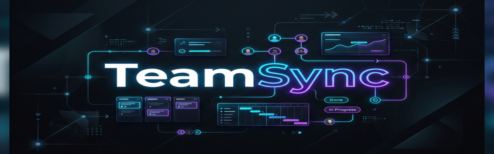

# TeamSync — B2B Project Management Platform

> A full-stack, production-grade project management platform for teams — built as a monorepo powered by **npm workspaces**.

<div align="center">
  
</div>

<div align="center">
  
  
  
  
  
  
  
</div>

---

## ⚡ Project at a Glance

| Category | Details |
|----------|---------|
| **Architecture** | Monorepo (npm workspaces) |
| **Frontend** | React + TypeScript + Vite + TailwindCSS |
| **Backend** | Node.js + Express + TypeScript |
| **Database** | MongoDB Atlas + Mongoose |
| **Authentication** | Local JWT + Google OAuth 2.0 |
| **Authorization** | Fine-grained Role-Based Access Control (RBAC) |
| **State Management** | TanStack React Query + Zustand |
| **Deployment** | Vercel (Client) + Render (API) |

---

## 📖 Project Overview

TeamSync is designed to solve the complexities of modern team collaboration. Built with a focus on multi-tenancy, it allows organizations to create isolated workspaces, manage complex role-based access control (RBAC), and streamline task lifecycles through an intuitive, real-time interface.

This repository is designed with a layered service architecture, multi-tenant workspace isolation, centralized error handling, and role-based authorization.

---

## ❓ Why TeamSync?

Most project management tools are either overly complex for small teams or lack customizable access control.

TeamSync was built to demonstrate how a scalable, multi-tenant collaboration platform can be architected using modern full-stack technologies while maintaining clean separation of concerns and production-ready engineering practices.

---

## 🚀 Live Demo

*(Placeholder: Link to the deployed application will be added here once hosting is configured)*

---

## 🌟 Production Highlights

- **Multi-Tenant Architecture**: Strict data isolation between workspaces.
- **Advanced RBAC**: Fine-grained, role-based access control mapped to specific user permissions.
- **Layered Security**: Rate limiting, Helmet headers, protected routes, and safe JWT management.
- **Optimized Data Layer**: MongoDB aggregation pipelines and strategic indexing.
- **Monorepo Design**: Shared dependencies and streamlined CI/CD through npm workspaces.

---

## 🏗️ System Architecture

```text
               React (Vite)
                    │
            TanStack Query
                    │
           Axios Interceptors
                    │
          JWT Authentication
                    │
         Express.js Router
                    │
      Controllers (Data Parsing)
                    │
     Services (Business Logic)
                    │
           Mongoose (ORM)
                    │
            MongoDB Atlas
```

---

## 📸 Application Previews

*(Screenshots to be added)*
- **Dashboard Overview**
- **Workspace Management**
- **Kanban Task Board**
- **Role Settings**
- **Authentication Screens**

---

## 🛠️ Tech Stack & Engineering Decisions

### Why MongoDB?
- **Flexible Schema**: Easily adapts to changing requirements without heavy migrations.
- **Workspace Isolation**: Multi-tenancy is straightforward to model using references.
- **Fast Iteration**: JSON-like documents map perfectly to TypeScript interfaces and frontend state.

### Why Service-Controller Pattern?
- **Keeps Controllers Thin**: HTTP request/response handling is strictly separated from business logic.
- **Business Logic Reusable**: Services can be called by web controllers, cron jobs, or CLI scripts.
- **Easy Testing**: Services can be unit tested without mocking Express request/response objects.

### Why TanStack React Query?
- **Avoids Manual Loading State**: Automatically handles `isPending`, `isError`, and `isFetching`.
- **Automatic Caching**: Reduces redundant network requests.
- **Optimistic Updates**: Instant UI feedback before the server responds.

### Why Zustand?
- **Minimal Boilerplate**: Much simpler and less verbose than Redux.
- **Right Tool for the Job**: Global state in this app is very small (mostly auth tokens); most state is server-state handled by React Query.

### Why npm Workspaces?
- **Shared Dependencies**: Hoists packages to the root, saving disk space and install time.
- **Single Install**: Run `npm install` once for the entire monorepo.
- **Shared Scripts**: Run `npm run dev` to start both frontend and backend concurrently.
- **Simpler CI**: Orchestrating builds in GitHub Actions is much easier.

---

## 📁 Folder Structure

```text
teamsync/
├── apps/
│   ├── client/                  # Frontend SPA
│   │   ├── src/components/      # UI components (asidebar, reusable, workspace)
│   │   ├── src/context/         # Global React Contexts
│   │   ├── src/hooks/           # Custom React hooks
│   │   ├── src/lib/             # Axios instances and API wrappers
│   │   ├── src/routes/          # React Router definitions
│   │   └── src/store/           # Zustand slices
│   │
│   └── server/                  # Backend API
│       ├── src/config/          # DB, HTTP, and Passport configs
│       ├── src/controllers/     # Request/Response handlers
│       ├── src/middlewares/     # Auth, error handling, validation
│       ├── src/models/          # Mongoose Schemas (User, Workspace, Task)
│       ├── src/routes/          # Express route definitions
│       └── src/services/        # Core business logic
│
├── .github/workflows/           # CI/CD pipelines
├── package.json                 # Root monorepo config
└── .env.example                 # Shared environment variables
```

---

## 🔐 Authentication Flow

```text
Login Request
      │
      ▼
Passport Local / OAuth
      │
      ▼
Verify Credentials
      │
      ▼
Generate JWT & Session Cookie
      │
      ▼
JSON Response containing Token
      │
      ▼
Zustand / Axios stores Token
      │
      ▼
Authorization Header attached to API calls
      │
      ▼
Protected APIs (Data Access)
```

---

## 🔄 Request Lifecycle

```text
Browser Action (e.g. Create Task)
      │
      ▼
Axios Interceptor (Injects JWT)
      │
      ▼
Express Route (`/api/v1/task/create`)
      │
      ▼
Auth Middleware (Verifies JWT)
      │
      ▼
Validation Middleware (Zod)
      │
      ▼
Controller (Extracts Req Body)
      │
      ▼
Service (Executes Business Logic)
      │
      ▼
MongoDB (Creates Document)
      │
      ▼
Controller (Formats Response)
      │
      ▼
JSON Response sent to Client
      │
      ▼
React Query Cache Invalidated
      │
      ▼
UI Re-renders Automatically
```

---

## 🗄️ Database Design

The schema is built for robust multi-tenancy and data integrity.

```text
Workspace (Root Entity)
      │
      ├── Member (Links User + Workspace + Role)
      │     └── Role (Contains Permission Arrays)
      │
      ├── Project (Grouped Tasks)
      │
      └── Task (Individual Work Units)
```

---

## 🛡️ RBAC Architecture

Role-Based Access Control is deeply integrated into the request lifecycle.

```text
User Requests Action (e.g. Delete Project)
      │
      ▼
Lookup User's Workspace
      │
      ▼
Find Member Record for User
      │
      ▼
Fetch Member's Assigned Role
      │
      ▼
Check Role's Permission List
      │
      ▼
`roleGuard()` Middleware Evaluates
      │
      ├── [Match] ──> Allow Action
      │
      └── [No Match] ──> Throw 403 ForbiddenException
```

---

## ✨ Current Capabilities

- **Multi-Tenant Workspaces**: Users can create, switch between, and manage multiple isolated workspaces.
- **Granular Permissions**: Invite users with specific roles (`OWNER`, `ADMIN`, `MEMBER`).
- **Project Tracking**: Organize tasks into categorized projects with emojis and descriptions.
- **Task Lifecycle**: Assign tasks, set priorities (`LOW`, `MEDIUM`, `HIGH`), and track statuses (`TODO`, `IN_PROGRESS`, `DONE`).
- **Real-Time Analytics**: Dashboard aggregates total, completed, and overdue tasks instantly.

---

## 💻 Local Setup

### Prerequisites
- Node.js `>= 18.0.0`
- MongoDB (running locally on `mongodb://localhost:27017` or Atlas)

### 1. Clone & Install
```bash
git clone https://github.com/ayushgupta-15/TeamSync.git
cd TeamSync
npm install
```

### 2. Configure Environment
```bash
# Server
cp apps/server/.env.example apps/server/.env
# Update .env with your MongoDB URI, JWT secrets, and Google OAuth credentials

# Client
cp apps/client/.env.example apps/client/.env
```

### 3. Seed Roles & Start Servers
```bash
# Seed the initial Roles into your database (Run once)
npm run seed

# Run the full monorepo (Client + Server concurrently)
npm run dev
```
- Client runs at: `http://localhost:5173`
- API runs at: `http://localhost:8000/api/v1`

---

## 📚 API Documentation

All routes are prefixed with `/api/v1`.

| Module | Endpoints |
|--------|-----------|
| **Auth** | `POST /auth/register`, `POST /auth/login`, `GET /auth/google` |
| **User** | `GET /user/current` |
| **Workspace** | `POST /workspace/create/new`, `GET /workspace/all`, `GET /workspace/:id`, `PUT /workspace/update/:id`, `DELETE /workspace/delete/:id` |
| **Member** | `GET /workspace/members/:id`, `POST /member/workspace/:inviteCode/join` |
| **Project** | `POST /project/workspace/:workspaceId/create`, `GET /project/workspace/:workspaceId/all`, `DELETE /project/:projectId/.../delete` |
| **Task** | `POST /task/project/:projectId/.../create`, `GET /task/workspace/:workspaceId/all`, `PUT /task/:taskId/.../update` |

---

## 🧪 Testing Strategy

**Current Status:**
- Backend integration tests (planned)
- Frontend component tests (planned)

**Frameworks:**
- **Jest**: Backend unit testing
- **Supertest**: API endpoint validation
- **Vitest**: Frontend unit testing
- **React Testing Library**: Component rendering & interaction

---

## ⚙️ CI/CD Pipeline

The project utilizes GitHub Actions to ensure code quality on every push and pull request.

```text
Push / PR Trigger
      │
      ▼
GitHub Actions Runtime
      │
      ├── [Job: Server] ──> Install ──> Build
      │
      └── [Job: Client] ──> Install ──> Lint ──> Build
```

---

## 🏎️ Performance Optimizations

- **React Query Caching**: Minimizes network waterfalls and redundant API calls.
- **MongoDB Aggregation Pipelines**: Replaces N+1 queries in analytical dashboards with single, highly optimized aggregation steps.
- **Database Indexes**: Compound and unique indexes on `Task`, `Member`, and `Account` models to prevent full-collection scans.
- **Optimistic UI Updates**: Instant UI feedback before the server confirms mutations.

---

## 🔒 Security Architecture

```text
Incoming HTTP Request
      │
      ▼
Helmet (Security Headers injected)
      │
      ▼
Express Rate Limiter (Brute-force protection)
      │
      ▼
CORS (Origin Verification)
      │
      ▼
Passport.js JWT Extraction
      │
      ▼
Zod Input Validation
      │
      ▼
Controller
```

---

## 🌐 Deployment Architecture (Target)

```text
      React SPA
       (Vercel)
          │
        HTTPS
          │
     Express.js API
       (Render)
          │
        Mongoose
          │
    MongoDB Atlas
          │
     Cloudinary
      (Future)
          │
       Redis
      (Future)
```

---

## 🎯 Core Engineering Principles

- Layered Architecture
- Separation of Concerns
- Single Responsibility Principle
- Type Safety (End-to-End TypeScript)
- Feature-based Folder Organization
- Centralized Error Handling
- Reusable UI Components
- RESTful API Design

---

## 📊 Repository Metrics

- **Monorepo Architecture**
- **2 Applications** (Client & Server)
- **TypeScript End-to-End**
- **RESTful API**
- **Multi-Tenant Design**
- **Role-Based Access Control**
- **GitHub Actions CI**

---

## 🗺️ Planned Enhancements

- [ ] **Real-time WebSockets:** Implement Socket.io for live task updates and notifications.
- [ ] **Redis Caching:** Cache session data and frequently accessed RBAC rules.
- [ ] **File Attachments:** AWS S3 integration for task attachments.
- [ ] **Dockerization:** Complete `docker-compose` setup for seamless cross-platform local development.

---

## 📄 License

MIT © [ayushgupta-15](https://github.com/ayushgupta-15)
